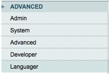

# Languager by Goodminton AG
Languager is a Magento 1.* module that makes the management of multi-language store more efficient and easier than ever. Install the module and start internationalizing!

# License
The module is delivered under the Apache License, Version 2.0

For more details see the file LICENSE or visit the page [http://www.apache.org/licenses/LICENSE-2.0](http://www.apache.org/licenses/LICENSE-2.0)

# How it works - Case study
Let's say you have a Magento Shop available in 3 countries each in different languages:
* Germany - German, English
* France - French, English
* Spain - Spanish, English

In order to translate each language you can simply select the desired store-view in the dropdown
on the product page or category page and write a new value for a certain attribute.

But as you can see english is used in three stores, with each its own store-view code, for example:
* Germany German: de-de
* Germany English: de-en
* France French: fr-fr
* France English: fr-en
* Spain Spanish: es-es
* Spain English: es-en

To translate the english store-views you have to edit each one every time you update a translation.

_Quite long and boring work!_

That's where Languager will make your life easier.

Simply associate a store-view to a language, configure which attribute are translated text
and as soon as a configured attribute's value changes, this value will be automatically saved in all store-view associated with the same language.

# Installation
In your composer.json add the following lines:
```
{
    ...
    "require": {
        ...
        "goodminton/languager": "dev-master"
    }
    ...
    "repositories" : [
        ...
        {
            "type": "vcs",
            "url": "https://github.com/goodminton-ag/languager.git"
        },
        ...
    ]
}
```

Then run:
```bash
composer.phar update
```

# Configuration
There are four different configuration pages.
Three pages for the configuration of the behavior of the module, and one for development configuration.

## Translation configuration


Store-views language association are defined under 'Stores configuration'

To select which attributes have translated values that must be saved in other store-views, use the drag-and-drop interface for products and categories

## Developer configuration



The module uses jQuery and jQuery-UI to make the interface friendlier and pleasanter to use. If you already included jQuery and jQuery-UI into your layout,
you can there deactivate the inclusion from the module if you experience avoid conflict

**Note: jQuery and jQuery UI are only included in the configuration pages of Languager (Stores configuration, products and categories attributes)**

# Author
* Pierre Bernard - [Goodminton AG](http://goodminton.com) - pierre.bernard@foodspring.com